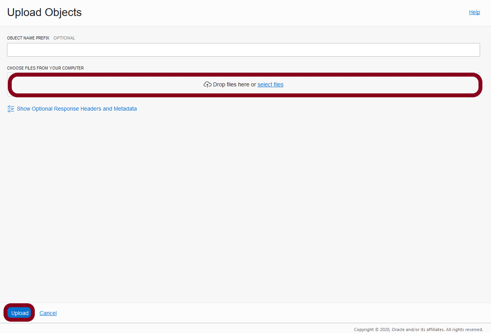

## Before You Begin

- Ensure you have supported browser version installed on your machine before you start. See [Supported Browsers](https://docs.cloud.oracle.com/en-us/iaas/Content/GSG/Tasks/signingin.htm?browser#supported_browsers)

# Always Free Resources - Application Development

### Introduction

This hands-on, instructor-led workshop supplements live presentations and demos in order to cover both technical architecture and educational use cases, strategies when using Oracle Cloud Infrastructure's Always Free Resources.

No expertise or previous experience is required.

### Objective

The objective of this Hands-on lab is to deploy a simple web application on Always Free resources inside the Oracle Cloud Infrastructure (OCI). The deployment will be manual, so you can understand better each step and relations between different OCI resources.

Contents
- Architecture
-	Identity & Access Management
-	Storage
- Autonomous Database
- Networking
- Compute
- Load Balancer

## **STEP 1:** Architecture

## **STEP 2.1:** Identity & Access Management Overview

Overview of Oracle Cloud Infrastructure Identity and Access Management
Oracle Cloud Infrastructure Identity and Access Management (IAM) lets you control who has access to your cloud resources. You can control what type of access a group of users have and to which specific resources. This section gives you an overview of IAM components. 

### Identity & Access Management Components

• **Resource**: The cloud objects that your company's employees create and use when interacting with Oracle Cloud Infrastructure. For example: compute instances, block storage volumes, virtual cloud networks (VCNs), subnets, route tables, etc.

• **Resource Identifiers**: Most types of Oracle Cloud Infrastructure resources have a unique, Oracle-assigned identifier called an Oracle Cloud ID (OCID). 

• **Compartment**: A Compartment is a collection of related resources (VCN, Compute Instances, etc). Compartments are a fundamental component of Oracle Cloud Infrastructure for organizing and isolating your cloud resources. You use them to clearly separate resources for the purposes of measuring usage and billing, access (through the use of policies), and isolation (separating the resources for one project or business unit from another). A common approach is to create a compartment for each major part of your organization. 

• **Tenancy**: The root compartment that contains all of your organization's Oracle Cloud Infrastructure resources. Oracle automatically creates your company's tenancy for you. Directly within the tenancy are your IAM entities (users, groups, compartments, and some policies; you can also put policies into compartments inside the tenancy). You place the other types of cloud resources (e.g., instances, virtual networks, block storage volumes, etc.) inside the compartments that you create.

• **Home Region**: The region where your IAM resources reside. All IAM resources are global and available across all regions, but the master set of definitions reside in a single region, the home region. You must make changes to your IAM resources in your home region. The changes will be automatically propagated to all regions. 

To see the full list of all IAM components please visit: https://docs.cloud.oracle.com/en-us/iaas/Content/Identity/Concepts/overview.htm

## **STEP 2.2:** Create your Compartment

Welcome to the main page of your Oracle Cloud account. This is also known as you home region. Here you can see shortcuts of how to quickly provision various cloud resources, along with information regarding your account. 

Click on the **Menu** icon on the top left side. Scroll all the way down to Governance and Administration section. Click on the menu item **Identity** and then click on **Compartments**.

This will bring up the Compartments administration page. Any Compartments created will be listed here along with information related to each Compartment such as: status, OCID, Authorized, the number of subcompartments and creation date. 

**Note:** You can create subcompartments in compartments to create hierarchies that are six levels deep. For the purposes of this workshop we will not use subcompartments.

Click on **Create Compartment**

**Name**: Give your Compartment a name, for example: oad-hol
**Description**: Provide a short description about your compartment, for example: **Oracle Academy Day - Hands on Lab** 

As mentioned earlier we will not use subcompartments so keep the Parent Compartment as: **root**

We will not use Tags so leave the fields empty.

Click on **Create Compartment**

The new compartment is now available in the compartment list.

## **STEP 3.1:** Autonomous Database Overview

In Oracle Cloud Infrastructure you can choose between two different Databases, Autonomous Datawarehouse and Autonomous Transaction Processing, The latter we will be provisioning today. 
Oracle Autonomous Transaction Processing delivers a self-driving, self-securing, self-repairing database service that can instantly scale to meet demands of a variety of applications: mission-critical transaction processing, mixed transactions and analytics, IoT, JSON documents, and so on.

To partician an Autonomous Database navigate to the 'Autonomous Transaction Processing' tab in the drop-down menu on the top right

Processed by pressing on 'Create Autonomous Database'

In the pop-up menu configure the following settings.
Note the difference between 'Shared Infrastructure' and 'Dedicated Infrastructure'.

1)Dedicated, a private cloud in public cloud choice. A completely dedicated compute, storage, network and database service for only a single tenant. Dedicated infrastructure provides for the highest levels of security isolation and governance. The customer has customizable operational policies to guide Autonomous Operations for workload placement, workload optimization, update scheduling, availability level, over provisioning and peak usage.
2)Shared, a simple and elastic choice. Oracle autonomously operates all aspects of the database life cycle from database placement to backup and updates. 

IMPORTANT: Note you Admin password, you will need it later!

When everything is set up as above click on 'Create Autonomous Database', this might take a few minutes

After the Status switches to 'Available', indicated by the green dot, you will be able to access the database

Click on the database name to see more details
Here you will find the option to connect to your Database and download the connection wallet

Click on the 'DB Connection', to pull up a pop-up allowing you to download the wallet.
Choose to 'Download Wallet'

Set up a password that allows you to download the wallet in the future and click on 'Download'

Finally save the downloaded wallet file in he 'Scripts' folder of the downloaded Mushop file downloaded at the start of this Lab

Congratulations you have successfully created an Autonomous Database and downloaded the connection wallet!

## **STEP 4.1:** Storage Overview

## **STEP 4.2:** Object Storage

Navigate to 'Object Storage' in your OCI Instance over the drop-down menu in the top left

Here we will create two buckets, 'mushop' and 'mushop-media', start creating one by clicking 'Create Bucket'

For both buckets set the following parameters and hit create once everything is set up

You should now have 2 buckets, both will be set to private by default

Now we will have to set mushop-media to public. Press on the name to see more options
Click Edit Visibility, in the pop-up window change the setting to public and Save Changes

Lastly we will upload files for mushop to the buckets we created

Press Upload and navigate to the files downloaded at the beginning of the workshop. Add the files to a bucket by dragging it on to the drop file field or clicking select file.
For mushop upload all files in the Scripts folder and for mushop-media upload all files in the Image folder.

## **STEP 5.1:** Networking Overview

## **STEP 6.1:** Compute Overview

## **STEP 7.1:** Load Balancer Overview

The Oracle Cloud Infrastructure Load Balancing service provides automated traffic distribution from one entry point to multiple servers reachable from your virtual cloud network (VCN). The service offers a load balancer with your choice of a public or private IP address, and provisioned bandwidth.

A load balancer improves resource utilization, facilitates scaling, and helps ensure high availability. You can configure multiple load balancing policies and application-specific health checks to ensure that the load balancer directs traffic only to healthy instances. The load balancer can reduce your maintenance window by draining traffic from an unhealthy application server before you remove it from service for maintenance.

## **STEP 7.2:** Create your Load Balancer 

In this first exercise, you will create your first Load Balancer. 

Before creating a Load Balancer you need to have the following cloud resources:
-	Virtual Cloud Network (VCN) 
-	A Public Subnet
-	An Internet Gateway
-	A Route Table
-	A security list 
and for that you will use the network resources that you have already created in the previews exersices.  

To create a Load Balancer click on the **Menu** icon on the top left side.

Navigate to **Networking**  and then click on **Load Balancers**

Make sure to select the same compartment where the rest of your cloud resources reside, and create your Load Balancer

Click on **Create Load Balancer**

First provide a **Name** for your Load Balancer and select the type: **Public**. Then choose its Maximum Total Bandwidth: **Micro** or **Small**.

Below select the **Virtual Cloud Network** and the **Subnet** created in the previous exersices. 

Click **Next**

Here you need to specify the load balancing policy. Choose **Weighted Round Robin** policy.

Below click on **Add Backends** button and select the compute instances that host the web application. 

At the **Specify Health Check Policy** section choose the following: 
-	**Protocol: HTTP**
-	**Port: 80**
The rest of the parameters are optional and you may use the pre-existing values.

Click on **Show Advanced Options** and choose the **Security List** tab. 
Here you may choose to configure the security list mannually or automatically. 

In case that you have not allowed any port rules to your subnet the Automatic method will automatically apply the Egress and Ingress rules for you. In this case on port 80.

In the last step of creating a Load Balancer, you will configure the Listener. 

-	Provide a **Name** for your listener
-	Choose Type of traffic: **HTTP**
-	Port:**80**

Click **Submit** 

Your Load Balancer is now in creating state...

After a few minutes your Load Balancer will become Active. 

Copy its IP Address and paste it on a different web browser tab or window. You should be able to reach your Web Application. 

**Note:** Wait a few minutes and you will notice that the Overall Heath will become green ✅ OK

The **Backend Sets Health** will also become green with no critical, warning or unknown errors.

