## Before You Begin

- Ensure you have supported browser version installed on your machine before you start. See [Supported Browsers](https://docs.cloud.oracle.com/en-us/iaas/Content/GSG/Tasks/signingin.htm?browser#supported_browsers)

# Always Free Resources - Application Development

### Introduction

This hands-on, instructor-led workshop supplements live presentations and demos in order to cover both technical architecture and educational use cases, strategies when using Oracle Cloud Infrastructure's Always Free Resources.

No expertise or previous experience is required.

### Objective

The objective of this Hands-on lab is to deploy a simple web application on Always Free resources inside the Oracle Cloud Infrastructure (OCI). The deployment will be manual, so you can understand better each step and relations between different OCI resources.

Contents
- Architecture
-	Identity & Access Management
-	Storage
- Autonomous Database
- Networking
- Compute
- Load Balancer

## **STEP 1:** Architecture

You will deploy the architecture below in the following exercises:

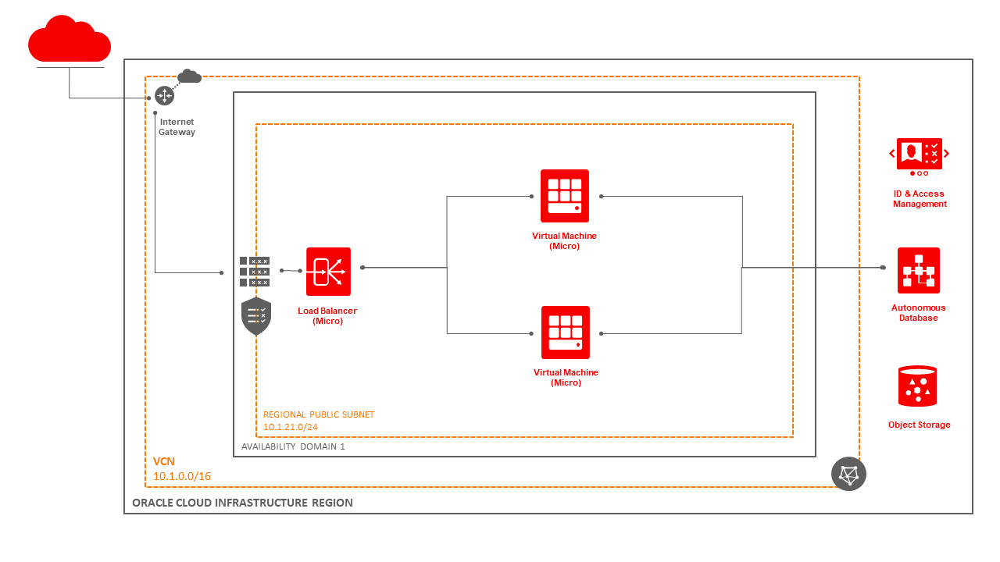

## **STEP 2.1:** Identity & Access Management Overview

Overview of Oracle Cloud Infrastructure Identity and Access Management
Oracle Cloud Infrastructure Identity and Access Management (IAM) lets you control who has access to your cloud resources. You can control what type of access a group of users have and to which specific resources. This section gives you an overview of IAM components. 

### Identity & Access Management Components

• **Resource**: The cloud objects that your company's employees create and use when interacting with Oracle Cloud Infrastructure. For example: compute instances, block storage volumes, virtual cloud networks (VCNs), subnets, route tables, etc.

• **Resource Identifiers**: Most types of Oracle Cloud Infrastructure resources have a unique, Oracle-assigned identifier called an Oracle Cloud ID (OCID). 

• **Compartment**: A Compartment is a collection of related resources (VCN, Compute Instances, etc). Compartments are a fundamental component of Oracle Cloud Infrastructure for organizing and isolating your cloud resources. You use them to clearly separate resources for the purposes of measuring usage and billing, access (through the use of policies), and isolation (separating the resources for one project or business unit from another). A common approach is to create a compartment for each major part of your organization. 

• **Tenancy**: The root compartment that contains all of your organization's Oracle Cloud Infrastructure resources. Oracle automatically creates your company's tenancy for you. Directly within the tenancy are your IAM entities (users, groups, compartments, and some policies; you can also put policies into compartments inside the tenancy). You place the other types of cloud resources (e.g., instances, virtual networks, block storage volumes, etc.) inside the compartments that you create.

• **Home Region**: The region where your IAM resources reside. All IAM resources are global and available across all regions, but the master set of definitions reside in a single region, the home region. You must make changes to your IAM resources in your home region. The changes will be automatically propagated to all regions. 

To see the full list of all IAM components please visit documentation [here](https://docs.cloud.oracle.com/en-us/iaas/Content/Identity/Concepts/overview.htm).

## **STEP 2.2:** Create your Compartment

Welcome to the main page of your Oracle Cloud account. This is also known as you home region. Here you can see shortcuts of how to quickly provision various cloud resources, along with information regarding your account. 

Click on the **Menu** icon on the top left side. Scroll all the way down to Governance and Administration section. Click on the menu item **Identity** and then click on **Compartments**.

This will bring up the Compartments administration page. Any Compartments created will be listed here along with information related to each Compartment.

**Note:** You can create subcompartments in compartments to create hierarchies that are six levels deep. For the purposes of this workshop we will not use subcompartments.

Click on **Create Compartment**

- **Name**: Give your Compartment a name, for example: **oad-hol**
- **Description**: Provide a short description about your compartment, for example: **Oracle Academy Day - Hands on Lab** 

As mentioned earlier we will not use subcompartments so keep the Parent Compartment as: **root**

We will not use Tags so leave the fields empty.

Click on **Create Compartment**

The new compartment is now available in the compartment list.

## **STEP 3:** Autonomous Database Overview

In Oracle Cloud Infrastructure you can choose between two different Databases, Autonomous Datawarehouse and Autonomous Transaction Processing, the latter we will be provisioning today. 
Oracle Autonomous Transaction Processing delivers a self-driving, self-securing, self-repairing database service that can instantly scale to meet demands of a variety of applications: mission-critical transaction processing, mixed transactions and analytics, IoT, JSON documents, and so on.

## **STEP 3.1:** Provisioning Autonomous Transaction Processing

To provision an Autonomous Database navigate to the **Autonomous Transaction Processing** tab in the drop-down menu on the top right

Processed by pressing on **Create Autonomous Database**

In the pop-up menu configure the following settings.
Note the difference between **Shared Infrastructure** and **Dedicated Infrastructure**.

- Dedicated, a private cloud in public cloud choice. A completely dedicated compute, storage, network and database service for only a single tenant. Dedicated infrastructure provides for the highest levels of security isolation and governance. The customer has customizable operational policies to guide Autonomous Operations for workload placement, workload optimization, update scheduling, availability level, over provisioning and peak usage.

- Shared, a simple and elastic choice. Oracle autonomously operates all aspects of the database life cycle from database placement to backup and updates. 

**NOTE: Save your Admin Password for later you will need it to access the warehouse and grant other users access to it.**

If you have an on-premises license you can bring it to the cloud by choosing **Bring your own License**. For this Lab we will go with **License included** so Oracle will provide you the license with your data warhouse.

When everything is set up as above click on **Create Autonomous Database**, this might take a few minutes

After the Status switches to **Available**, indicated by the green dot, you will be able to access the database

## **STEP 3.2:** Downloading the Connection Wallet

Click on the database name to see more details.
Here you can find all the information about your data warehouse that you need.
In order to connect to your transaction processing you will require a Connection Wallet. This will guarantee you a secure connection to the transation processing and only users with access to that wallet will be able to connect, so keep it safe and do not distribute it freely.
On the top left you will find the 'DB Connecton' option, click it to start downloading the connection wallet.

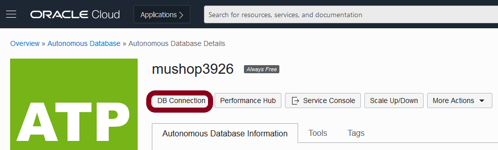

Choose to **Download Wallet* in the pop-up window.

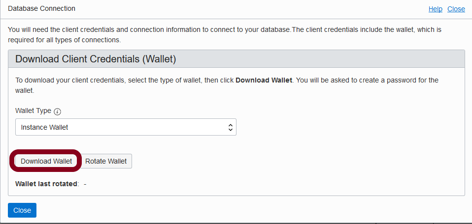

Set up a password that allows you to download the wallet in the future and click on **Download**.

Finally save the downloaded wallet file in he **Scripts** folder of the downloaded Mushop file downloaded at the start of this Lab

**Congratulations, you have successfully created an Autonomous Database and downloaded the connection wallet!**

## **STEP 4:** Storage Overview

Oracle Cloud Infrastructure has several different types of storage available:

   - Archive Storage
   - Block Volume
   - Data Transfer
   - File Storage
   - Object Storage
   - Storage Gateway

In this Lab we will focus on Object Storage as it is best suited for constant use of data.
Use Object Storage for data to which you need fast, immediate, and frequent access. Data accessibility and performance justifies a higher price to store data in the Object Storage tier.

if you are interested in any other type of storage listed above please visit documentation [here](https://docs.cloud.oracle.com/en-us/iaas/Content/home.htm).

## **STEP 4.1:** Object Storage

Navigate to **Object Storage** in your OCI Instance over the drop-down menu in the top left.

Here we will create two buckets and name them **mushop** and **mushop-media**, start creating one by clicking **Create Bucket**.
Buckets are the logical containers in which you store objects.

For both buckets set the following parameters and hit create once everything is set up.

You should now have 2 buckets, both will be set to private by default.

Now we will have to set mushop-media to public. Press on the name to see more options.
Click Edit Visibility, in the pop-up window change the setting to public and **Save Changes**.

Lastly we will upload files for mushop to the buckets we created.

Press Upload and navigate to the files downloaded at the beginning of the workshop. Add the files to a bucket by dragging it on to the drop file field or clicking select file.
For mushop upload all files in the Scripts folder and for mushop-media upload all files in the Image folder.

## **STEP 5:** Virtual Cloud Networks Overview

Oracle Cloud Infrastructure lets you create multiple Virtual Cloud Networks (VCNs). These VCNs will contain the subnets, security lists, route tables, compute instances, load balancers and many other types of network assets.

### Networking Components

You will be using these networking components in the following exercises:

- **Virtual Cloud Network (VCN)**: A virtual, private network that you set up in Oracle data centers. It closely resembles a traditional network, with firewall rules and specific types of communication gateways that you can choose to use.

- **Public IP**: A public IPv4 address and related information.

- **Private IP**: A private IPv4 address and related information for addressing an instance (for example, a hostname for DNS).

- **VNIC**: A virtual network interface card (VNIC), which attaches to an instance and resides in a subnet to enable a connection to the subnet's VCN. The VNIC determines how the instance connects with endpoints inside and outside the VCN. Each instance has a primary VNIC that's created during instance launch and cannot be removed.

- **Subnet**: Subdivisions you define in a VCN (for example, 10.0.0.0/24 and 10.0.1.0/24). Subnets contain virtual network interface cards (VNICs), which attach to instances. Each subnet consists of a contiguous range of IP addresses that do not overlap with other subnets in the VCN.

- **Security List**: Virtual firewall rules for your VCN. They are ingress and egress rules that specify the types of traffic (protocol and port) allowed in and out of the instances.

- **Internet Gateway**: For resources with public IP addresses that need to be reached from the internet (example: a web server) or need to initiate connections to the internet.

- **Route Table**: Virtual route tables for your VCN. They have rules to route traffic from subnets to destinations outside the VCN by way of gateways or specially configured instances.

- **Availability Domain**: Your VCN resides in a single Oracle Cloud Infrastructure region. A region can have multiple availability domains (individual datacenters) to provide isolation and redundancy.

Please review [Overview of Networking](https://docs.cloud.oracle.com/en-us/iaas/Content/Network/Concepts/overview.htm) to gain full understanding of the network components and their relationships, or take a look at this video:

<iframe src="https://www.youtube.com/embed/mIYSgeX5FkM" frameborder="0" allow="accelerometer; autoplay; encrypted-media; gyroscope; picture-in-picture" allowfullscreen></iframe>

## **STEP 5.1:** Create Your VCN

To create VCN on Oracle Cloud Infrastructure navigate to the **Virtual Cloud Networks** tab and click **Create VCN**. Make sure to select the same compartment where the rest of your cloud resources reside, and create your VCN.

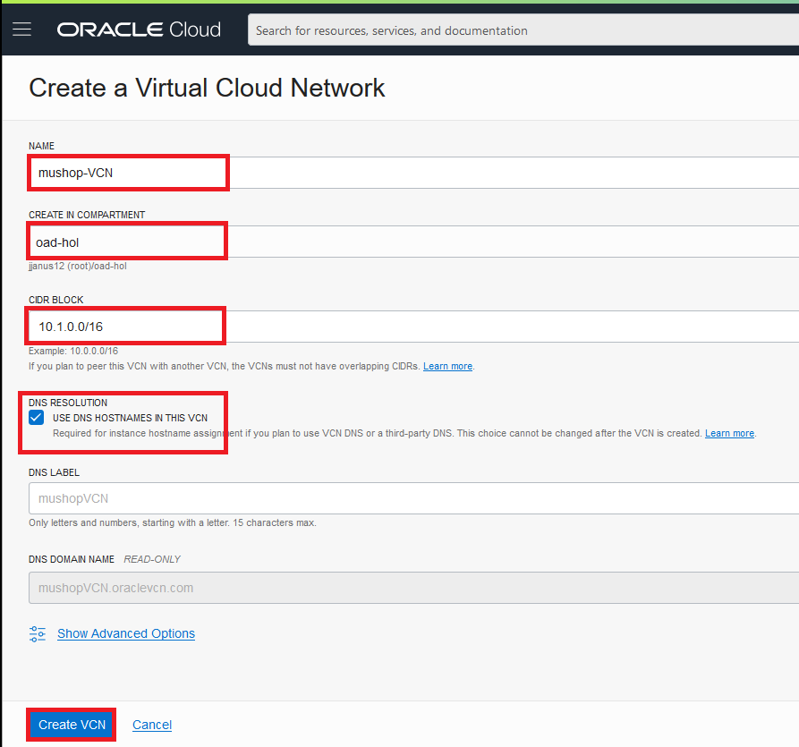

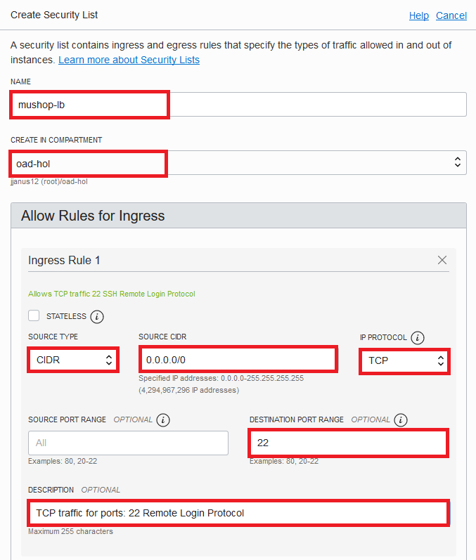

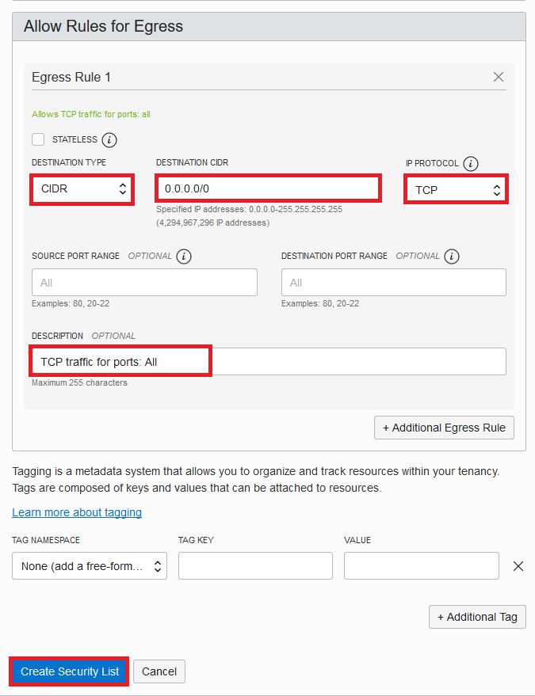

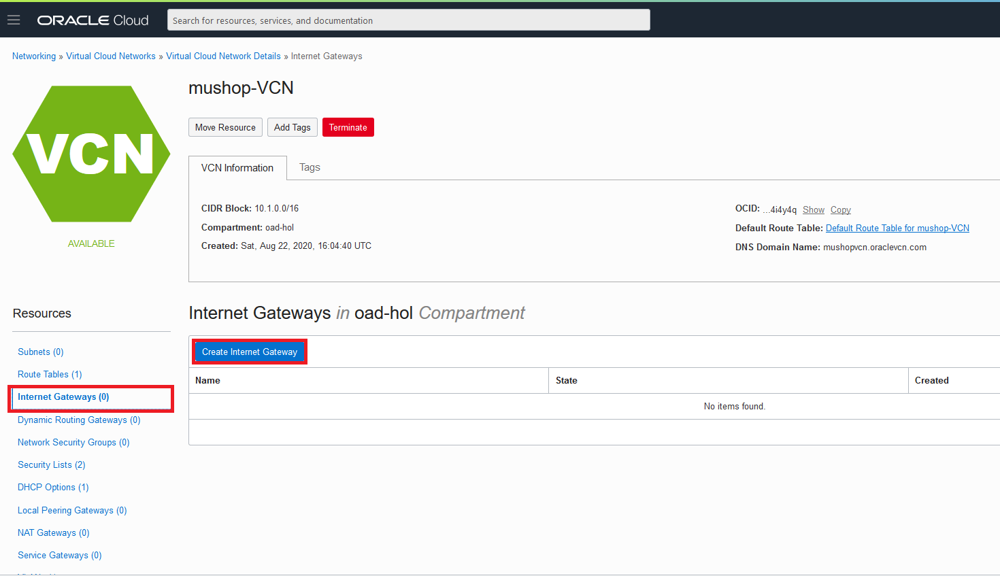

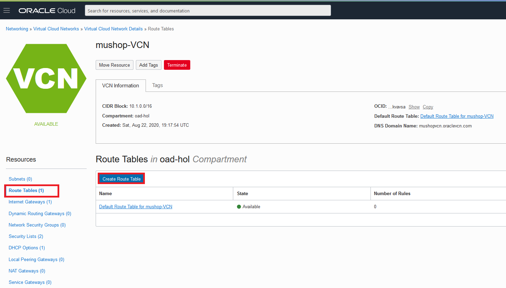

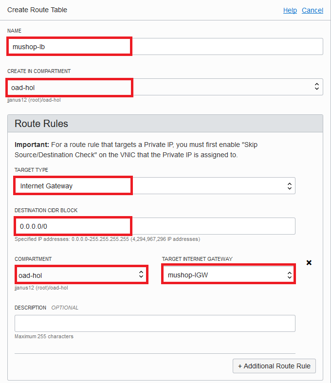

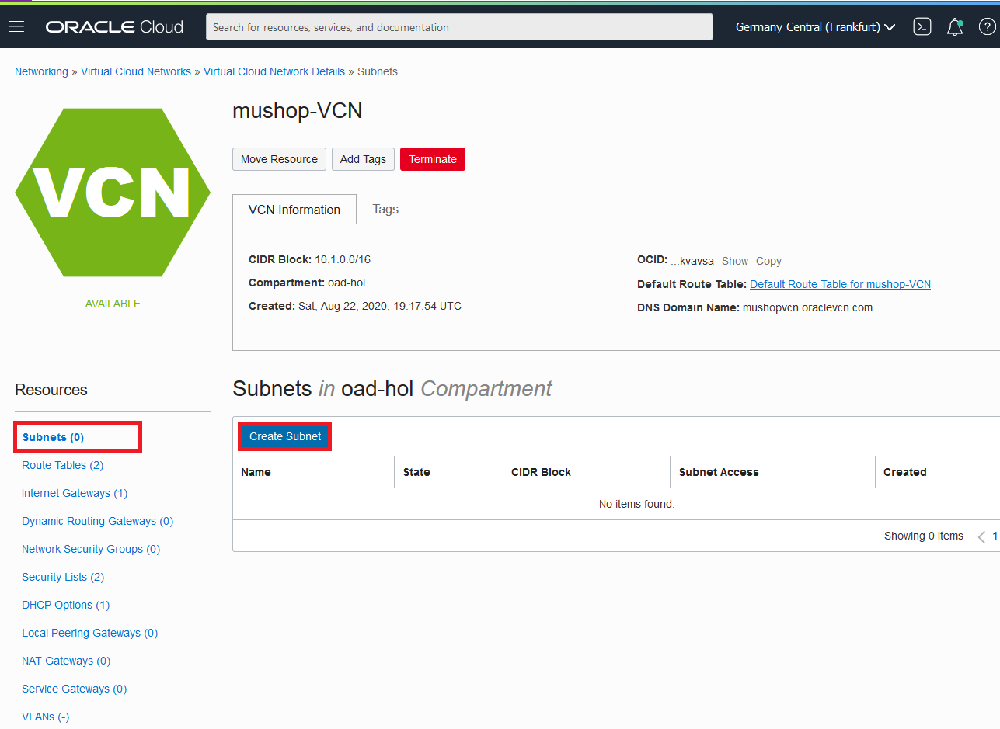

**Note**: In real-world situations, you would create multiple VCNs based on their need for access (which ports to open) and who can access them.

**Congratulations, you have successfully created and configured your first VCN!**

## **STEP 6:** Compute Overview

Oracle Cloud Infrastructure Compute lets you provision and manage compute hosts, known as instances. You can launch instances as needed to meet your compute and application requirements. After you launch an instance, you can access it securely from your computer, restart it, attach and detach volumes, and terminate it when you're done with it. Any changes made to the instance's local drives are lost when you terminate it. Any saved changes to volumes attached to the instance are retained.

Please review [Best Practices for Your Compute Instance](https://docs.cloud.oracle.com/iaas/Content/Compute/References/bestpracticescompute.htm) for important information about working with your Oracle Cloud Infrastructure Compute instance.

### Compute Components

**User data**: is a mechanism to inject a script or custom metadata when a compute instance is initializing on Oracle Cloud Infrastructure. This data is passed to the instance at provisioning time to customize the instance as needed. Instance user data can be implemented using variety of scripting languages.

## **STEP 6.1:** Generate SSH Keys

The SSH (Secure Shell) protocol is a method for secure remote login from one computer to another. SSH enables secure system administration and file transfers over insecure networks using encryption to secure the connections between endpoints. SSH keys are an important part of securely accessing Oracle Cloud Infrastructure compute instances in the cloud.

We recommend you use the Oracle **Cloud Shell** to interface with the OCI compute instance you will create. Oracle Cloud Shell is browser-based, does not require installation or configuration of software on your laptop, and works independently of your network setup.

**IMPORTANT: If the SSH key is not created correctly, you will not be able to connect to your environment and will get errors. Please ensure you create your key properly.**

The Cloud Shell machine is a small virtual machine running a Bash shell which you access through the OCI Console (Homepage). Cloud Shell comes with a pre-authenticated OCI CLI (Command Line Interface), set to the Console tenancy home page region, as well as up-to-date tools and utilities. To use the Cloud Shell machine, your tenancy administrator must grant the required IAM (Identity and Access Management) policy.

To start the Oracle Cloud Shell, go to your Cloud console and click the **cloud shell icon** at the top right of the page. Then wait a bit until Cloud Shell gets started.

Once the cloud shell has started, enter the following command to create a new directory .ssh:

<pre>
<button class="copy-button" title="Copy text to clipboard">Copy</button>
<code>
mkdir .ssh
</code>
</pre>

Enter the following command to **change directory** to .ssh directory you have just created:

<pre>
<button class="copy-button" title="Copy text to clipboard">Copy</button>
<code>
cd .ssh
</code>
</pre>

Enter the following command to generate your ssh key:

<pre>
<button class="copy-button" title="Copy text to clipboard">Copy</button>
<code>
ssh-keygen -b 2048 -t rsa -f &lt;sshkeyname&gt;
</code>
</pre>

**Note**: Replace the **&lt;sshkeyname&gt;** with the **keyname** you can remember. This will be the **keyname** you will use to connect to any compute instances you create.

Press **Enter** twice for no passphrase.

Examine the two files that you just created with the following command:

<pre>
<button class="copy-button" title="Copy text to clipboard">Copy</button>
<code>
ls
</code>
</pre>

**Note**: You will see two files in the output, a private key: **sshkeyname** and a public key: **sshkeyname**.pub. Keep the private key safe and don't share its content with anyone. The public key will be needed for various activities and can be uploaded to certain systems as well as copied and pasted to facilitate secure communications in the cloud.

To list the contents of the public key, use the following command:

<pre>
<button class="copy-button" title="Copy text to clipboard">Copy</button>
<code>
cat <sshkeyname>.pub
</code>
</pre>

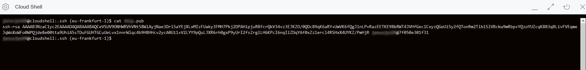

Mark the key and copy it (e.g. use the Notepad). You will be pasting the key into the compute instance in the following steps, make sure that you remove any hard return that may have been added when copying. **The .pub key should be one line.**

**Congratulations, you have successfully generated your ssh keys!**

## **STEP 6.2:** Creating a Web Server on a Compute Instance

Oracle Cloud Infrastructure offers both Bare Metal and Virtual Machine instances:

- **Bare Metal** - A bare metal compute instance gives you dedicated physical server access for highest performance and strong isolation.
- **Virtual Machine** - A Virtual Machine (VM) is an independent computing environment that runs on top of physical bare metal hardware. The virtualization makes it possible to run multiple VMs that are isolated from each other. VMs are ideal for running applications that do not require the performance and resources (CPU, memory, network bandwidth, storage) of an entire physical machine.

An Oracle Cloud Infrastructure VM compute instance runs on the same hardware as a Bare Metal instance, leveraging the same cloud-optimized hardware, firmware, software stack, and networking infrastructure.

Navigate to the **Compute** tab and click **Create Instance**. We will launch a VM instance for this lab.

The Create Compute Instance wizard will launch. Set the name of the server to **mushop-Web-Server-1**. Click on the **Show Shape, Networking, Storage Options** link to expand that area of the page.

Most of the defaults are perfect for our purposes. Make sure you select the option to assign a Public IP address.

**Note**: You need a public IP address so that you can SSH into the running instance later in this lab.

Scroll down to the SSH area of the page. Choose **PASTE SSH KEYS** that you created earlier in Generate SSH Keys step.

Click on **Show Advanced Options**.

Enter the following **Cloud-Init** custom user data startup script:

<pre>
<button class="copy-button" title="Copy text to clipboard">Copy</button>
<code>

#!/bin/bash
echo "-----------------configure firewall-----------------------"

sudo firewall-offline-cmd --add-port=80/tcp
sudo systemctl restart firewalld

echo "-----------------Install the yum repo-----------------------"

curl -sL https://rpm.nodesource.com/setup_10.x | sudo -E bash -

echo "-----------------Install build tools & nodeJS-----------------------"

sudo yum install -y gcc-c++ make nodejs wget unzip httpd jq
sudo yum -y install oracle-release-el7
sudo yum-config-manager --enable ol7_oracle_instantclient
sudo yum -y install oracle-instantclient19.3-basic oracle-instantclient19.3-jdbc oracle-instantclient19.3-sqlplus

echo "-----------------Install the cli-----------------------"
sudo yum install -y python36-oci-cli

</code>
</pre>

Press the **Create** button to create your instance.

Launching an instance is simple and intuitive with few options to select. The **provisioning** of the compute instance will complete in less than a minute and the instance state will change from provisioning to running.

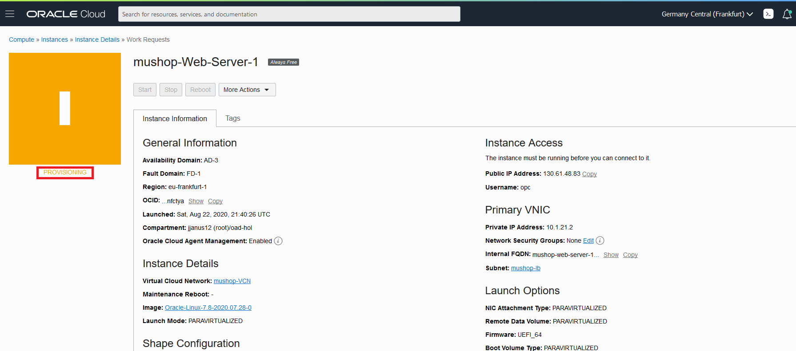

Once the instance state changes to **Running**, you can SSH to the Public IP address of the instance.

**Congratulations, you have successfully provisioned and initially configured your first Web Server!**

## **STEP 6.3:** Connect to the Compute Instance and Deploy the Application

To connect to the instance switch back to **Cloud Shell**, where you enter the following command:

<pre>
<button class="copy-button" title="Copy text to clipboard">Copy</button>
<code>
ssh opc@&lt;public_ip_address&gt;
</code>
</pre>

If you have a different path for your SSH key enter the following:

<pre>
<button class="copy-button" title="Copy text to clipboard">Copy</button>
<code>
ssh -i &lt;path_to_private_ssh_key&gt; opc@&lt;public_ip_address&gt;
</code>
</pre>

**Note**: For Oracle Linux VM, the default username is **opc**. Replace the **&lt;public_ip_address&gt;** with the Public IP address of your instance (you will find it on your instance details under Instance Access).

Make sure you logged in as user **opc** and that you see the **name of your instance** you logged on.

Enter the following command to change your current user **opc** to superuser **root**:

<pre>
<button class="copy-button" title="Copy text to clipboard">Copy</button>
<code>
sudo -s
</code>
</pre>

Make sure your user changed to the **root** user and continue with the following command to configure Command-Line-Interface (CLI):

<pre>
<button class="copy-button" title="Copy text to clipboard">Copy</button>
<code>
oci setup config
</code>
</pre>

**Note**: We will use CLI to download the files needed for application installation from the private object storage bucket to the instance.

Press Enter to keep the **default location** for your CLI config. Then it will ask you for **user OCID** for that click on the icon at the top right of the page and select **User Settings**:

Enter the following command to change the current directory to .oci:

<pre>
<button class="copy-button" title="Copy text to clipboard">Copy</button>
<code>
cd ~/.oci
</code>
</pre>

Enter the following command to list items inside the directory:

<pre>
<button class="copy-button" title="Copy text to clipboard">Copy</button>
<code>
ls
</code>
</pre>

Enter the following command to read the content of your oci_api_key_public.pem file:

<pre>
<button class="copy-button" title="Copy text to clipboard">Copy</button>
<code>
cat oci_api_key_public.pem
</code>
</pre>

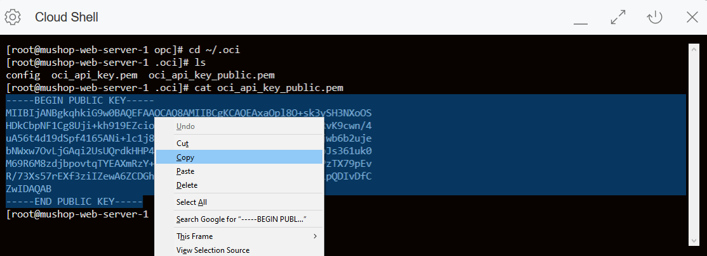

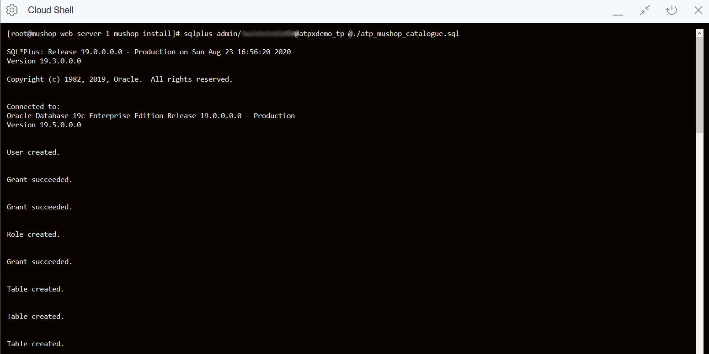

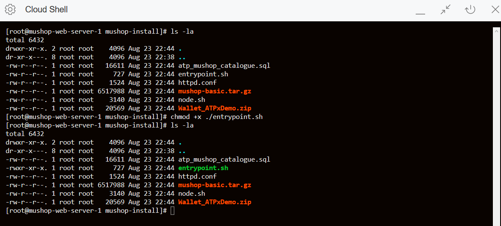

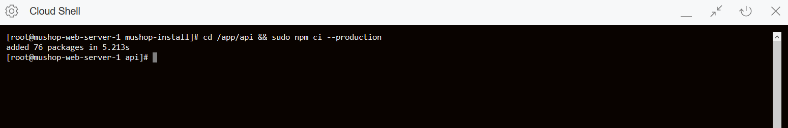

## **STEP 6.4:** Create a Boot Volume Clone

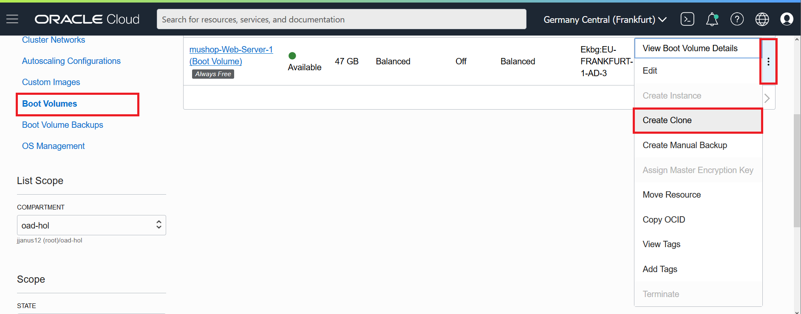

## **STEP 6.5:** Create a second Web Server from the Boot Volume Clone

## **STEP 7:** Load Balancer Overview

The Oracle Cloud Infrastructure Load Balancing service provides automated traffic distribution from one entry point to multiple servers reachable from your virtual cloud network (VCN). The service offers a load balancer with your choice of a public or private IP address, and provisioned bandwidth.

A load balancer improves resource utilization, facilitates scaling, and helps ensure high availability. You can configure multiple load balancing policies and application-specific health checks to ensure that the load balancer directs traffic only to healthy instances. The load balancer can reduce your maintenance window by draining traffic from an unhealthy application server before you remove it from service for maintenance.

### Load Balancing Components

**Public Load Balancer**: To accept traffic from the internet, you create a public load balancer. The service assigns it a public IP address that serves as the entry point for incoming traffic. 

**Private Load Balancer**: To isolate your load balancer from the internet and simplify your security posture, you can create a private load balancer. The Load Balancing service assigns it a private IP address that serves as the entry point for incoming traffic.

**Load Balancer Bandwitdth**: A template that determines the load balancer's total pre-provisioned maximum capacity (bandwidth) for ingress plus egress traffic. Available shapes include 10Mbps, 100 Mbps, 400 Mbps, and 8000 Mbps.

**Load Balancing Policy**: A load balancing policy tells the load balancer how to distribute incoming traffic to the backend servers. Common load balancer policies include:
- Round robin
- Least connections
- IP hash

**Health Check Policy**: A health check is a test to confirm the availability of backend servers. A health check can be a request or a connection attempt. You can configure TCP-level or HTTP-level health checks for your backend servers. Based on a time interval you specify, the load balancer applies the health check policy to continuously monitor backend servers. 

**Backend Server**: An application server responsible for generating content in reply to the incoming TCP or HTTP traffic. 

**Backend Set**: A logical entity defined by a list of backend servers, a load balancing policy, and a health check policy.

**Listener**: A logical entity that checks for incoming traffic on the load balancer's IP address. You configure a listener's protocol and port number, and the optional SSL settings. To handle TCP, HTTP, and HTTPS traffic, you must configure multiple listeners.

To see the full list of all Load Balancing components please visit documentation [here](https://docs.cloud.oracle.com/en-us/iaas/Content/Balance/Concepts/balanceoverview.htm).

## **STEP 7.1:** Create your Load Balancer 

In this first exercise, you will create your first Load Balancer. 

Before creating a Load Balancer you need to have the following cloud resources:
-	Virtual Cloud Network (VCN) 
-	A Public Subnet
-	An Internet Gateway
-	A Route Table
-	A security list 
and for that you will use the network resources that you have already created in the previews exersices.  

To create a Load Balancer click on the **Menu** icon on the top left side.

Navigate to **Networking**  and then click on **Load Balancers**

Make sure to select the same compartment where the rest of your cloud resources reside, and create your Load Balancer

Click on **Create Load Balancer**

First provide a **Name** for your Load Balancer and select the type: **Public**. Then choose its Maximum Total Bandwidth: **Micro** or **Small**.

Below select the **Virtual Cloud Network** and the **Subnet** created in the previous exersices. 

Click **Next**

Here you need to specify the load balancing policy. Choose **Weighted Round Robin** policy.

Below click on **Add Backends** button and select the compute instances that host the web application. 

At the **Specify Health Check Policy** section choose the following: 
-	**Protocol: HTTP**
-	**Port: 80**
The rest of the parameters are optional and you may use the pre-existing values.

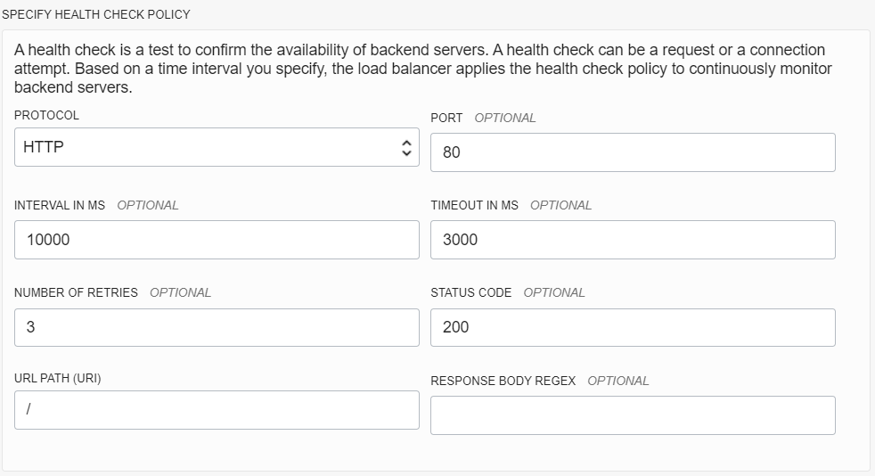

Click on **Show Advanced Options** and choose the **Security List** tab. 
Here you may choose to configure the security list mannually or automatically. 

In case that you have not allowed any port rules to your subnet the Automatic method will automatically apply the Egress and Ingress rules for you. In this case on port 80.

In the last step of creating a Load Balancer, you will configure the Listener. 

-	Provide a **Name** for your listener
-	Choose Type of traffic: **HTTP**
-	Port:**80**

Click **Submit** 

Your Load Balancer is now in creating state...

After a few minutes your Load Balancer will become Active. 

Copy its IP Address and paste it on a different web browser tab or window. You should be able to reach your Web Application. 

**Note:** Wait a few minutes and you will notice that the Overall Heath will become green ✅ OK

The **Backend Sets Health** will also become green with no critical, warning or unknown errors.

